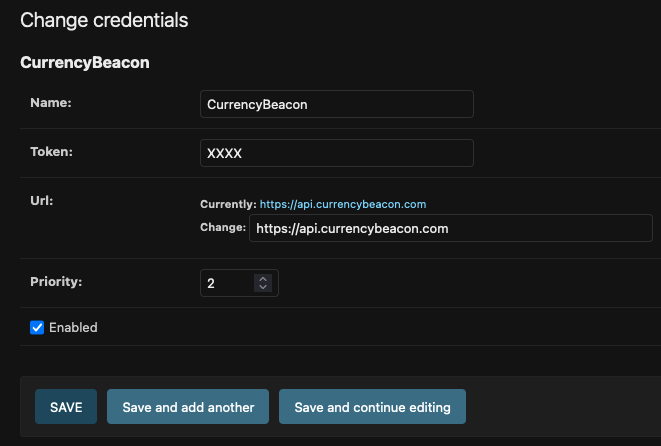
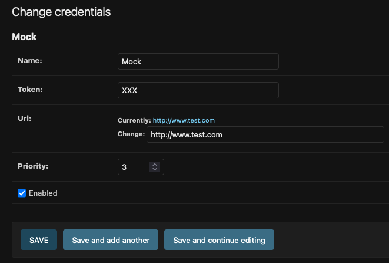

# MyCurrency - Python Backend Test

## Introduction
**MyCurrency** is a web platform designed to calculate currency exchange rates. It integrates with external providers, such as [CurrencyBeacon](https://currencybeacon.com/), to retrieve and store daily exchange rates. The platform is built for flexibility, enabling seamless integration with multiple currency data providers, each with potentially unique APIs.

- **Sign Up**: Create a free account at [CurrencyBeacon](https://currencybeacon.com/register).  
- **API Docs**: Explore the [CurrencyBeacon API Documentation](https://currencybeacon.com/api-documentation).  
- **Supported Currencies**: `EUR`, `CHF`, `USD`, `GBP`.

## Functionalities
This is a Django-based application built with **Python 3.11** and **Django 4/5**. It:
- Stores currencies and daily exchange rates.
- Exposes a REST API for use by frontend or mobile applications.

---

## Prerequisites
- **Python 3.11**
- **Git**

---

## Installation

1. **Clone the Repository**  
   ```bash
   git clone git@github.com:oredondo/my_currency.git
   ```

2. **Set Up a Virtual Environment**  
   ```bash
   python3.11 -m venv myenv
   source myenv/bin/activate  # On Windows: myenv\Scripts\activate
   ```

3. **Install Dependencies**  
   ```bash
   pip3.11 install -r requirements.txt
   ```

4. **Run Migrations**  
   ```bash
   python3.11 manage.py migrate
   ```

5. **Create a Superuser**  
   ```bash
   python3.11 manage.py createsuperuser
   ```

6. **Start the Development Server**  
   ```bash
   python3.11 manage.py runserver
   ```

7. **Access the Admin Interface**  
   Open your browser and visit:  
   [http://localhost:8000/admin](http://localhost:8000/admin)

---

## Configuration

### 1. Add Provider Credentials
- Navigate to the admin dashboard:  
  [http://localhost:8000/admin/providers/credentials/](http://localhost:8000/admin/providers/credentials/)
- Add credentials for your providers (e.g., CurrencyBeacon).  
  Example with a mock provider:  
    
  

### 2. Add Currency Information
- Go to:  
  [http://localhost:8000/admin/currencies/currency/](http://localhost:8000/admin/currencies/currency/)
- Input details for the supported currencies (`EUR`, `CHF`, `USD`, `GBP`).

---

## API Usage

### 1. CRUD Currencies
- **Endpoint**: [http://localhost:8000/api/v1/currencies/](http://localhost:8000/api/v1/currencies/)  
- **Purpose**: Create, read, update, and delete currencies.

### 2. List Exchange Rates
- **Endpoint**: [http://localhost:8000/api/v1/currency_rate_list/](http://localhost:8000/api/v1/currency_rate_list/)  
- **Purpose**: Retrieve a list of exchange rates for a specific currency.  
- **Parameters**:  
  - `source_currency=EUR`  
  - `date_from=2020-03-10`  
  - `date_to=2020-03-10`  
- **Example**:  
  ```
  http://localhost:8000/api/v1/currency_rate_list/?source_currency=EUR&date_from=2020-03-10&date_to=2020-03-10
  ```

### 3. Convert Amounts
- **Endpoint**: [http://localhost:8000/api/v1/convert_amount/](http://localhost:8000/api/v1/convert_amount/)  
- **Purpose**: Convert an amount between two currencies.  
- **Parameters**:  
  - `source_currency=EUR`  
  - `exchanged_currency=USD`  
  - `amount=10`  
- **Example**:  
  ```
  http://localhost:8000/api/v1/convert_amount/?source_currency=EUR&exchanged_currency=USD&amount=10
  ```

---

## Notes
- **[Postman Collection](/currency.postman_collection.json)**: A Postman collection is included to simplify API testing and usage. Import it into Postman to get started quickly.
---